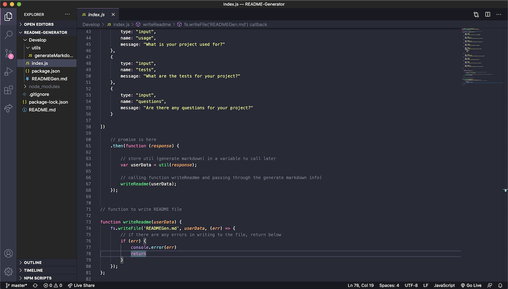
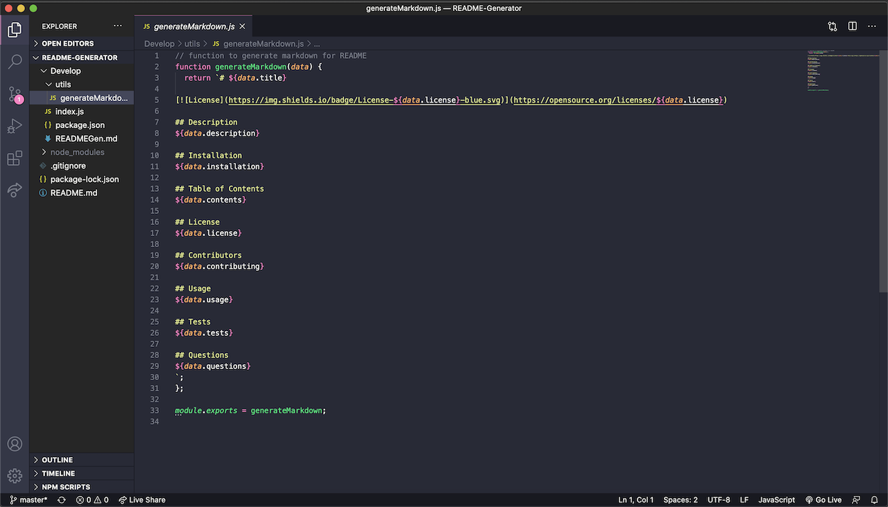
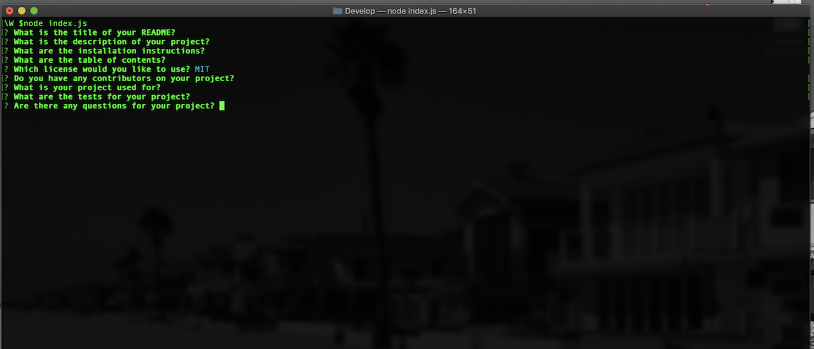

# README Generator

Link to walkthrough: [README Generator Walkthrough](https://drive.google.com/file/d/1pmkgB8YdTGQR9sl2uYLp-aAfGmAzwTac/view)

## Description
Asked to generate a README.md file using node.js and the inquirer package with certain criteria to be met.

## How it works
    1. Install the inquirer package
    2. Prompt user to answer questions to generate a README.md
    3. Generate a markdown file and enter data to be pulled from
    4. Write file using fs.writeFile

### Code for Questions

### Code for function storing data in markdown file

### Code for markdown data to create README file

### Running the app in command line

### Generated README file

## Credits/Technologies
    1. JavaScript
    2. Node.js
    3. Inquirer Package